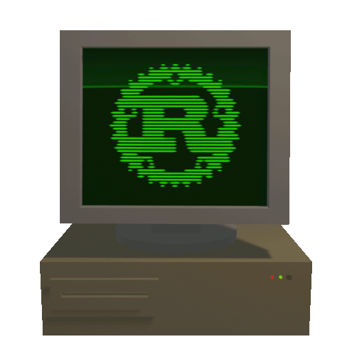

# Retro Technologies Working Group (RWG)

_"Now old iron can rust too"_

This repository and assosiated issue tracker is for coordinating and managing members of the Retro Working Group.

## Goals:
The Retro Working Group exists to promote support for Rust on classic hardware platforms, that may otherwise be overlooked by the core developement goals. 

Our work stems from the values that old technology can still be useful if supported correctly and that old PC's are useful for more than just retro gaming. 

Specifically we work with platforms that are performance and memory constrained, and where existing software often has serious security issues.

## Join In:
### Contact us:
You can find us in our matrix chat: [#RustRetro:matrix.org](https://matrix.to/#/#RustRetro:matrix.org)

This room is bridged into IRC: #rust-retro on Freenode.
